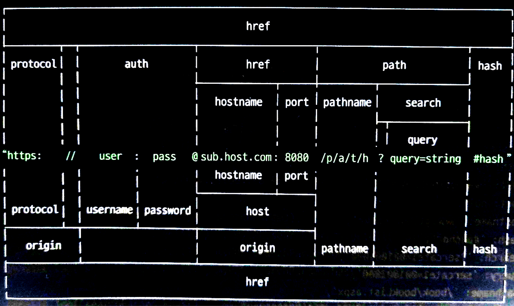

# 노드 내장 모듈

노드의 모듈은 노드 버전마다 차이가 있지만, 여기서는 버전과 상관없이 안정적이고, 유용한 기능을 지닌 모듈만 기술

### os - os.js
운영체제에 대한 정보를 가져오는 모듈

### path - path.js
폴더와 파일의 경로를 쉽게 조작하도록 도와주는 모듈  
운영체제 별로 경로 구분자가 다르기 때문에 path 모듈이 필요

### url 
인터넷 주소를 쉽게 조작하도록 도와주는 모듈  
url 처리 방식은 두가지 인데 노드 7버전 부터 추가된 WHATWG 방식과 이전부터 사용하던 url 방식 두가지  
  
다음 그림에서 가운데 주소를 기준으로 위쪽이 기존 노드 url 구분법 아래쪽이 WAHTWG의 url 구분법이다

- 기존 노드 방식 - url.js
  - 주소가 host 부분없이 pathname(ex: /book/bookList.jsp)만 오는 경우에는 WHATWG방식으로 처리 할 수 없기 때문에 기존 노드 방식으로 처리
- WHATWG 방식 - whatwg.js
  - searchParams 라는 특수한 객체를 이용하여 query string을 처리하는데 용이함

### querystring - querystring.js
WHATWG 방식의 url 대신 기존 노드의 url을 사용할 때 search 부분을 사용하기 쉽게 객체로 만드는 모듈

### cryto - cryto.js
다양한 방식의 암호화를 도와주는 모듈
- 단방향 암호화 - md5, sha, bcrypt
- 양방향 암호화 - aes

### util - util.js
각종 편의 기능을 모아둔 모듈
- util.deprecate - 함수가 deprecated 처리 되었음을 알려줌
- util.promisify - 콜백 패턴을 프로미스 패컨으로 바꿔줌

