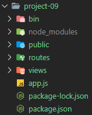
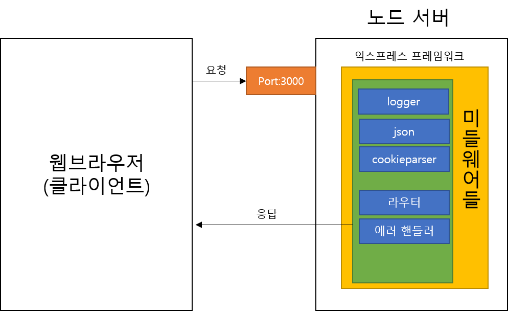

# Express 프레임워크

## Express 설치
Express-generator를 통해 프레임워크에 필요한 디렉터리 구조와 package.json을 만든다.  
Express-generator는 콘솔 명령어 이기 때문에 npm 전역 설치가 필요하다
```bash
$ npm i -g express-generator # npm install --global express-generator와 동일
```

Express-generator 설치 후 새로 프로젝트를 만들고자 하는 폴더로 이동해서  
express <프로젝트 이름>으로 새 익스프레스 프로젝트를 생성한다.  
  
여기서 --view=pug 옵션을 주게 되는데 Express는 기본적으로 Jade를 템플릿 엔진으로 설치한다.  
Jade는 Pug로 개명한지 오래되었고, 옛버전인 Jade 대신 최신 버전인 Pug를 설치하기 위해서 옵션을 준다
  
명령을 실행하게 되면 project-09 디렉터리 안에 Express 프레임워크를 사용하기 위한 기본 구조가 잡히게 된다.
```bash
$ express project-09 --view=pug
```

생성한 프로젝트 폴더 project-09로 이동 후 npm 모듈들을 설치한다.
```bash
$ cd project-09 && npm i
```

명령어 실행시 다음과 같은 디렉터리 구조로 변경되어 있으면 성공이다.  
  
- app.js
  - 핵심적인 서버 역할
- bin/www
  - 서버를 실행하는 스크립트
- public 폴더
  - 외부(브라우저 등 클라이언트)에서 접근 가능한 파일을 모아둔 곳 - 이미지, 자바스크립트, css파일등
- routes 폴더
  - 주소별 라우터들을 모아둔 곳 : 서버 로직 처리
- views 폴더
  - 템플릿 파일을 모아둔 곳 : 클라이언트 화면 처리

### 서버 실행
```bash
$ npm start
```

### Express 프레임워크 구조
[](2.png)
- 미들웨어
  - 요청과 응답의 중간에 위치하여 요청과 응답을 조작하여 기능을 추가하거나 나쁜 요청을 걸러냄
  - 미들웨어는 app.use와 함께 사용됨. - app.js
    - app.use 메서드의 인자로 들어 있는 함수가 미들웨어 
    - 미들웨어는 user 메서드로 app에 장착
    - 가장 먼저 선언된 미들웨어(여기서는 logger부터)들을 순으로 라우터에서 클라이언트로 응답을 보냄
```js
//...
app.use(logger('dev'));
app.use(express.json());
app.use(express.urlencoded({ extended: false }));
app.use(cookieParser());
app.use(express.static(path.join(__dirname, 'public')));

app.use('/', indexRouter);
app.use('/users', usersRouter);

// catch 404 and forward to error handler
app.use(function(req, res, next) {
  next(createError(404));
});

// error handler
app.use(function(err, req, res, next) {
  // set locals, only providing error in development
  res.locals.message = err.message;
  res.locals.error = req.app.get('env') === 'development' ? err : {};

  // render the error page
  res.status(err.status || 500);
  res.render('error');
});
//...
```

### 커스텀 미들웨어 만들기
직접 미들웨어를 만들어 express의 app.js에 등록할 수 있다.  
다음 미들웨어는 요청이 들어올때 마다 '미들웨어 입니다'를 콘솔에 출력한다.  
  
주의 할점은 미들웨어 로직을 작성후 next()를 호출해야 다음 미들웨어로 넘어간다.  
next()는 미들웨어의 흐름을 제어하는 핵심 함수다.  
  
next()를 호출하지 않을시 next()를 호출하지 않는 미들웨어에서 흐름이 끊긴다.
```js
app.set('views', path.join(__dirname, 'views'));
app.set('view engine', 'pug');

// 새 미들웨어 등록
app.use(function(req, res, next) {
  console.log(req.url, '미들웨어 입니다');
  next()
});
```

next() 함수는 인자의 종류로 기능이 구분된다.  
```js
next() // 단순하게 다음 미들웨어로 넘어감

next('route') // 다음 라우터로 이동함

next(error) // 다른 미들웨어나 라우터를 건너 뛰고 바로 에러 핸들러로 이동
```

404처리 미들웨어
```js
app.use(function(req, res, next) {
  next(createError(404));
});
```

에러 핸들링 미들웨어는 미들웨어중 제일 아래에 위치하여 위에서 발생한 미들웨어에서 발생한 에러를 처리
```js
// error handler
app.use(function(err, req, res, next) {
  // set locals, only providing error in development
  res.locals.message = err.message;
  res.locals.error = req.app.get('env') === 'development' ? err : {};

  // render the error page
  res.status(err.status || 500);
  res.render('error');
});
```

### morgan 미들웨어 - 콘솔 로그 미들웨어
GET /users 304 5.292 ms - - 같은 로그를 콘솔에 기록해 준다.
```js
//...
var logger = require('morgan');

//...
app.use(logger('dev'));
//...
```
`app.use(logger('dev'));` 함수의 인자로 dev, short, common, combined등을 줄 수 있다.  
인자에 따라 콘솔에 나오는 로그가 다르다. 개발시는 dev, short를 주로 쓰고, 배포시에는 common과 combined를 많이 사용한다.

### body-parser
요청의 본문을 해석해 주는 미들웨어이다. 보통 폼 데이터나 AJAX요청의 데이터를 처리한다.  
```js
var bodyParser = require('body-parser')
//...
app.user(bodyParser.json())
app.user(bodyParser.urlencoded({extended: false}))
```
express 4.16.0 버전 부터 body-parser의 일부기능이 내장 되어있기 때문에 body-parser를 설치하지 않고도  
다음과 같이 할 수 있다.
```js
app.use(express.json());
app.use(express.urlencoded({ extended: false }));
```
body-parser는 JSON과 URL-encoded 형식의 본문 외에도 Raw, Text 형식의 본문을 추가로 해석할 수 있다.  
Raw는 본문이 버퍼 데이터일 때, Text는 본문이 텍스트 데이터일 때 해석하는 미들웨어이다.  
서비스에 적용하고 싶다면 body-parser를 설치한 후 다음과 같이 추가한다.
```js
app.use(bodyParser.raw())
app.use(bodyParser.text())
```

JSON은 json형식의 데이터 전달 방식이고 URL-encoded는 주소형식으로 데이터를 보내느 방식이다.  
보통 폼 전송이 이 방식을 주로 사용한다.  
  
urlencoded 옵션의 extended값을 false로 주면 노드의 querystring 모듈을 사용하여 쿼리스트링을 해석하고  
true면 qs모듈을 사용하여 쿼리스트링을 해석한다.  
  
qs 모듈을 내장모듈이 아니라 npm 패키지이며, querystring모듈을 조금 더 확장한 패키지이다.  
  
값에 접근하는 것은 `req.body['parameter']` 형식으로 접근해서 사용한다. 

### cookie-parser
요청에 동봉된 쿠키를 해석해준다  
```js
var cookieParser = require('cookie-parser')

app.user(cookieParser())
```

해석된 쿠키는  `req.cookies` 객체에 들어간다. 즉 `req.cookies['cookie key']` 형태로 쿠키값에 접근 가능하다.  

다음과 같이 첫번째 인자로 문자열을 넣어 줄 수도 있다.  
이렇게 하면 쿠키들을 제공한 문자열로 서명된 쿠키가 된다. 서명된 쿠키는 클라이언트에서 수정했을 때 에러가 발생하므로  
클라이언트에서 쿠키로 위험한 행동을 하는 것을 방지할 수 있다.
```js
app.user(cookieParser('secret code'))
```

### static 
정적인 파일들을 제공한다. express를 설치하면 내장되어 있기 때문에 따로 설치할 필요는 없다.  
정적 파일 라이터 기능을 처리하는 미들웨어는 최대한 위쪽에 배치하는 것이 좋다.  
그래야 쓸데 없는 미들웨어 작업을 막을 수 있다. (morgan 다음에 배치하는 것을 추천)
```js
app.use(logger('dev'));
app.use(express.static(path.join(__dirname, 'public')));
```
  
함수의 인자로 정적 파일들이 담겨있는 폴더를 지정하면된다.  
정적 파일 경로가 다음과 같이 설정되어 있다면  
public/stylesheets/styles.css는 http://localhost:3000/stylesheets/styles.css로 접근할 수 있다.
```js
app.use(express.static(path.join(__dirname, 'public')))
```